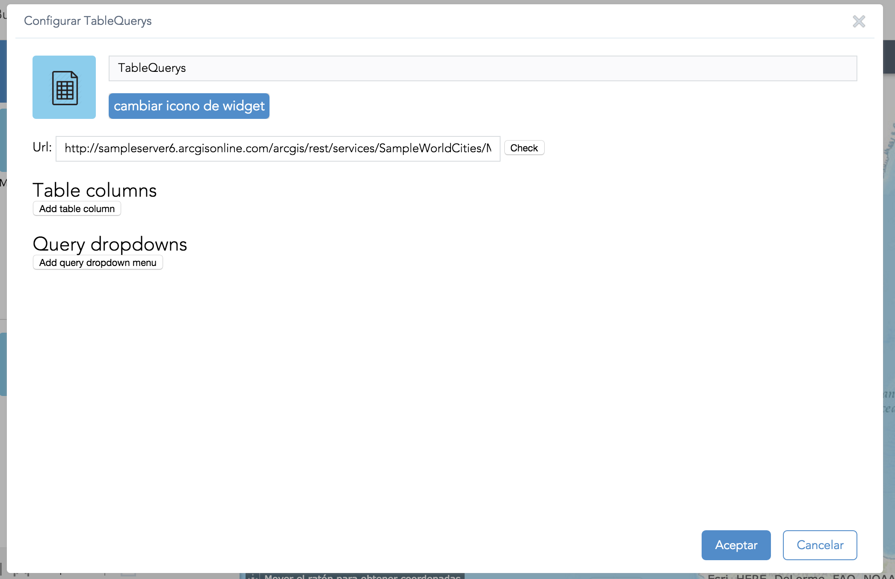
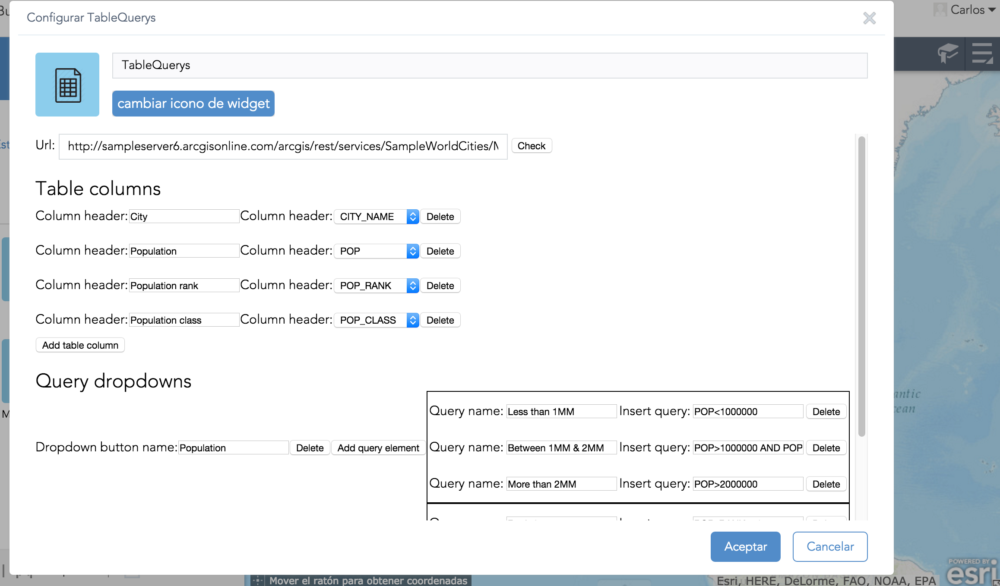
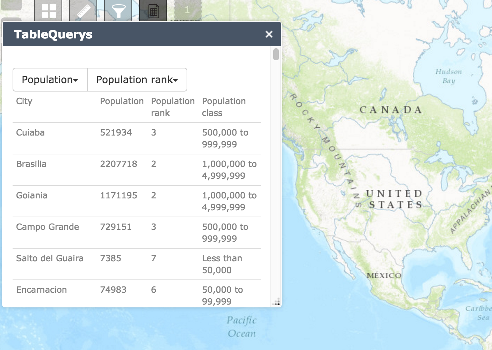
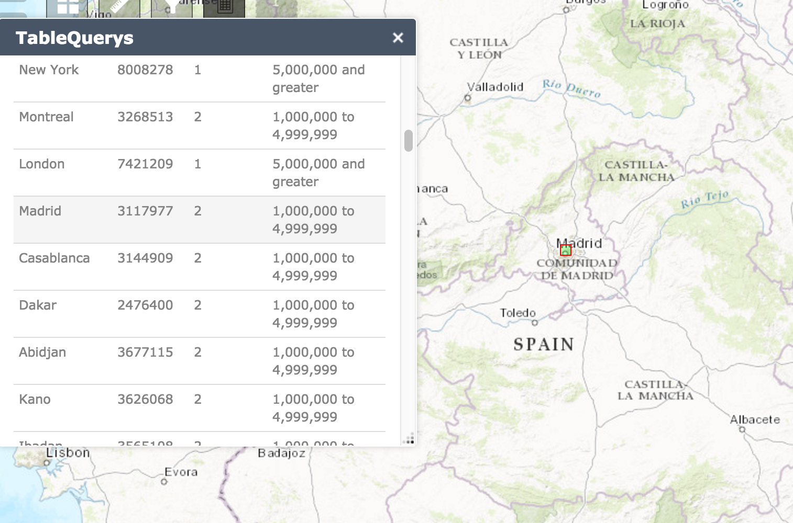
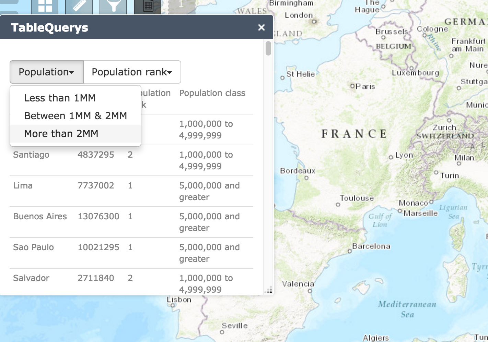
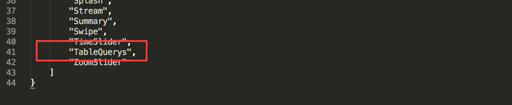

# TableQuery-WebAppWidget

A query Widget where you can set as many querys as you want on as many dropdown bottons as you please and set how many fields you want to see in the features table.

[Sample app with the Table Query Widget](http://jimeno0.github.io/TableQueryWidget/TableQueryWidgetApp/index.html)

Developed for Web AppBuilder.

## About

### Initial config

* You can set as many table rows and dropdown buttons with querys just adding new elements in the config window:

  * 

* For example we feed the config with te following params:

  * 

### Widget

* Once we have our widget config ready we will see a table with all our features: 

  * 

* By clicking on each feature the map will center on the selected element and we will see it drawed:

  * 

* By seleccing any of the defined querys we'll se the features that meets the query:

  * 

##Installation

To see the widget once we open any of our App we need to follow the next steps:

* It works with Bootrstap so we have to replace the index.html and the init.js files from our web app (or add the code lines that you can find below comments like //Bootstrap).

* Copy the TableQuerys folder inside the stemapp/widgets directory

* And finally we need to go to the list.json file inside stemapp/widgets and add the widget name to the list:

  * 

